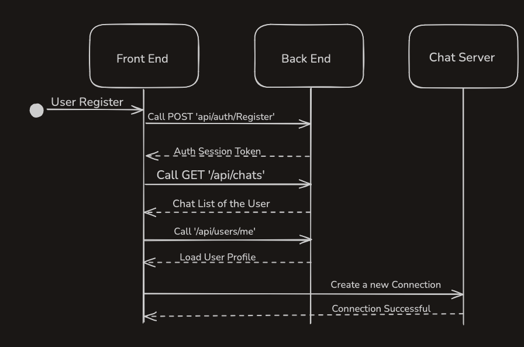
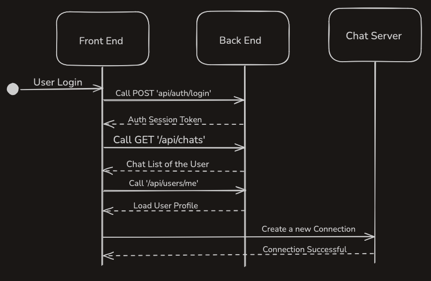
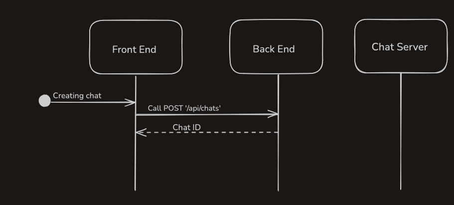
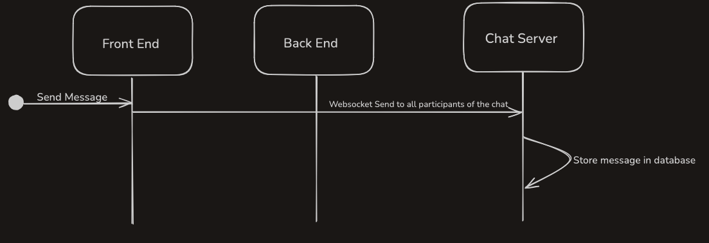

# Web Chat

Full-stack chat reference app with account management, multi-user chat rooms, persistent history, and live delivery over WebSockets. Frontend, REST API, WebSocket gateway, and MongoDB each run as isolated services orchestrated by Docker Compose.

## Features
- Authentication: register/login with salted password hashes, bearer tokens, session TTL refresh, and profile retrieval.
- Chat management: create direct or group chats, deterministic IDs for 1:1 rooms (optional), participant caps, and sorted recency.
- Messaging: persisted chat history per room with retention limits, message validation, and optimistic WebSocket fan-out.
- User profile: editable email, logout, and persisted client-side auth/session state.
- Operational settings: global limits exposed via `/api/settings` (message retention, participant cap, deterministic IDs).
- Delivery: resilient WebSocket client with auto-reconnect; REST and WS base URLs configurable per environment.

## Architecture
- `frontend` – Vite React SPA served by Nginx.
- `backend` – Express REST API with MongoDB persistence and session issuance.
- `chatServer` – WebSocket gateway broadcasting chat payloads to connected clients.
- `mongo` – MongoDB 6.x datastore.

```
services/
├── backend         # REST API + auth + persistence
├── frontend        # React client (Vite build served by Nginx)
├── chatServer      # WebSocket gateway
└── mongo           # MongoDB storage
```

Default ports: frontend 3000, REST API 4000, WebSocket 4001, MongoDB 27017.

## Quick start (Docker)
```bash
docker compose up --build -d
```
- Frontend: http://localhost:3000  
- REST API base: http://localhost:4000  
- WebSocket: ws://localhost:4001  
- Mongo: mongodb://localhost:27017

## Local development (without Docker)
Frontend env:
```
VITE_API_URL=http://localhost:4000
VITE_WS_URL=ws://localhost:4001
```
Backend env:
```
MONGO_URL=mongodb://localhost:27017
MONGO_DB=webchat
MONGO_MESSAGES_COLLECTION=messages
MONGO_CHATS_COLLECTION=chats
MONGO_SETTINGS_COLLECTION=settings
MONGO_USERS_COLLECTION=users
MAX_MESSAGES=100
MAX_PARTICIPANTS=25
SESSION_TTL_MS=86400000
CORS_ORIGIN=http://localhost:3000
```

## API surface
Authentication and profile
| Method | Endpoint               | Purpose                                  |
| ------ | ---------------------- | ---------------------------------------- |
| POST   | `/api/auth/register`   | Create account, return bearer token      |
| POST   | `/api/auth/login`      | Authenticate, return bearer token        |
| GET    | `/api/users/me`        | Retrieve current user profile            |
| PUT    | `/api/users/me`        | Update profile (email)                   |

Chat and messaging
| Method | Endpoint                          | Purpose                                           |
| ------ | --------------------------------- | ------------------------------------------------- |
| GET    | `/api/chats`                      | List chats for the authenticated user             |
| POST   | `/api/chats`                      | Create direct/group chat (auto-add current user)  |
| GET    | `/api/chats/:chatId/messages`     | List messages for a chat                          |
| POST   | `/api/chats/:chatId/messages`     | Persist a new message for a chat                  |

Operations
| Method | Endpoint          | Purpose                                      |
| ------ | ----------------- | -------------------------------------------- |
| GET    | `/api/health`     | Ping MongoDB                                 |
| GET    | `/api/settings`   | Read global settings                         |
| PUT    | `/api/settings`   | Update global settings (admin usage)         |

Message schema (REST/WebSocket payloads): `id`, `chatId`, `userId`, `message`, `timestamp`.

## WebSocket contract
- Connect to `ws://localhost:4001`.
- Server welcome: `{ "type": "system-message", "payload": { "message": string } }`.
- Broadcast: `{ "type": "chat-message", "payload": Message }` where `Message` matches the REST response.
- Clients publish the same payload returned by `POST /api/chats/:chatId/messages` to keep IDs/timestamps aligned.

## System diagrams

### User Registration


### User Login


### Create Chat


### Send Message

